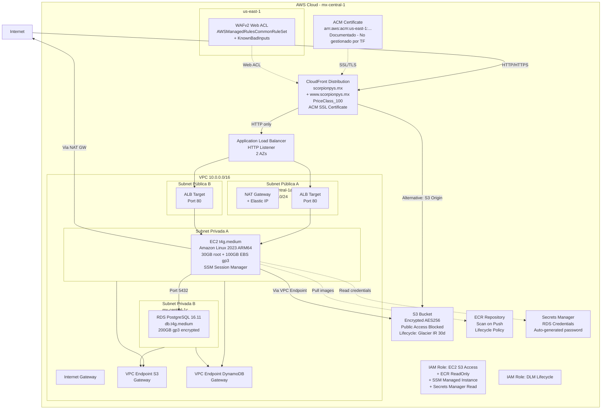
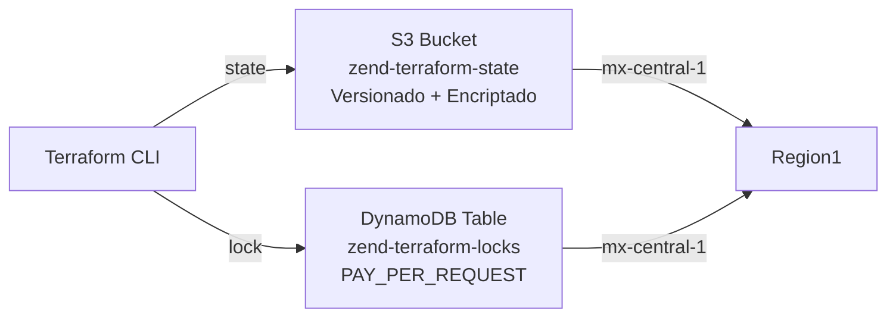
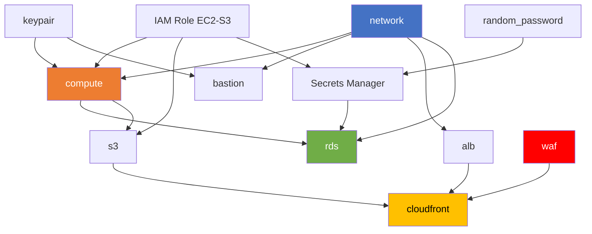

# Architecture Overview - infra-aws-zend

> **Estado**: Confirmado por código | **Región**: mx-central-1 + us-east-1 (WAF/ACM)

## Diagrama de Arquitectura General



## Flujo de Tráfico Principales

### 1. Tráfico Web Público (flujo principal)

```
Usuario → CloudFront (scorpionpys.mx) → WAF (us-east-1) → ALB (2 AZs) → EC2 (privada)
```

- CloudFront termina HTTPS con certificado ACM (us-east-1)
- WAF inspecciona requests antes de forward al origin
- ALB escucha en puerto 80 (HTTP) - sin certificado en ALB
- ALB forward a EC2 en subnet privada (puerto 80)
- Security Group adicionales permiten tráfico ALB → EC2

### 2. Tráfico S3 desde CloudFront (alternativo)

```
Usuario → CloudFront → OAI → S3 Bucket (modo lectura pública bloqueada, acceso via OAI)
```

- Controlado por `cloudfront_origin_s3_bucket`
- Si se especifica un bucket S3, CloudFront apunta al bucket directamente

### 3. Acceso EC2

```
Operador → AWS SSM Session Manager → EC2 (privada)
Operador → SSH → Bastion (pública) → EC2 (privada)  [solo si enable_bastion=true]
```

- SSM es el método recomendado (ya configurado con AmazonSSMManagedInstanceCore)
- Bastion está deshabilitado por defecto (`enable_bastion = false`)

### 4. Acceso RDS desde EC2

```
EC2 → RDS PostgreSQL (5432) en subnet privada
Operador → SSM Port Forwarding → EC2 → RDS (túnel)
```

- RDS es `publicly_accessible = false`
- Security Group permite tráfico desde EC2 y VPC CIDR

### 5. Salida a Internet desde subnets privadas

```
EC2/RDS (privada) → NAT Gateway (pública) → Internet Gateway → Internet
EC2 → S3/DynamoDB (via VPC Gateway Endpoints - sin NAT)
```

## Componentes de Arquitectura

| Componente | Tipo | Región | Notas |
|-----------|------|--------|-------|
| **CloudFront** | CDN + SSL | Global | Certificado ACM en us-east-1 |
| **WAF** | Firewall | us-east-1 | Scope CLOUDFRONT, obligatorio en us-east-1 |
| **ALB** | Load Balancer | mx-central-1 | 2 AZs, HTTP listener |
| **EC2** | Compute | mx-central-1 | t4g.medium, ARM64, subnet privada |
| **RDS** | Database | mx-central-1 | PostgreSQL 16.11, single-AZ |
| **S3 App** | Storage | mx-central-1 | Bucket de aplicación con lifecycle |
| **S3 State** | State Backend | mx-central-1 | Bucket para Terraform state |
| **DynamoDB** | State Lock | mx-central-1 | Tabla para Terraform locks |
| **ECR** | Container Registry | mx-central-1 | Repositorio Docker |
| **Secrets Manager** | Secrets | mx-central-1 | Credenciales RDS auto-generadas |
| **IAM** | Identity | mx-central-1 | 2 roles (EC2-S3, DLM) + policies |
| **NAT Gateway** | Networking | mx-central-1 | En subnet pública con EIP |
| **VPC Endpoints** | Networking | mx-central-1 | S3 + DynamoDB (Gateway) |

## Backend de Terraform



- **S3 Bucket**: `zend-terraform-state`, versionado, encriptado AES256, public access blocked
- **DynamoDB**: `zend-terraform-locks`, PAY_PER_REQUEST, hash key `LockID`
- **Creado por**: `envs/bootstrap/` (ejecutar solo una vez)
- **Usado por**: `envs/prod/` (configurado en `providers.tf`)

## Dependencias entre Módulos



## Multi-Región

| Servicio | Región | Razón |
|----------|--------|-------|
| Infraestructura principal | mx-central-1 | Región primaria del proyecto |
| WAF (CloudFront scope) | us-east-1 | Requisito de AWS: WAF para CloudFront DEBE estar en us-east-1 |
| ACM Certificate | us-east-1 | Requisito de AWS: certificados para CloudFront DEBEN estar en us-east-1 |
| Provider alias | `aws.us_east_1` | Configurado en `envs/prod/providers.tf` para crear recursos en us-east-1 |

## Configuración por Defecto (tfvars)

| Variable | Valor | Notas |
|----------|-------|-------|
| `private_subnet_az` | `mx-central-1a` | Override del default `mx-central-1b` |
| `enable_ecr` | `true` | Override del default `false` |
| `ecr_repository_name` | `zend-app` | Personalizado |
| `rds_master_password` | `Sc0rp1on2025!` | **CRÍTICO**: Hardcodeada en tfvars |
| `rds_database_name` | `zenddb` | |
| `rds_master_username` | `scorpion_db_user` | Override del default `postgres` |
| `acm_certificate_arn` | `arn:aws:acm:us-east-1:514005485945:certificate/...` | Hardcodeado |