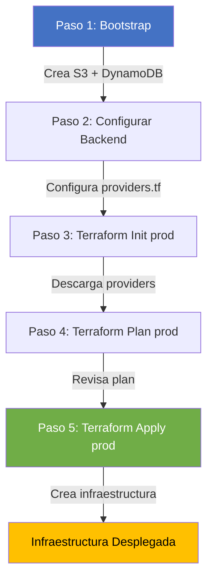
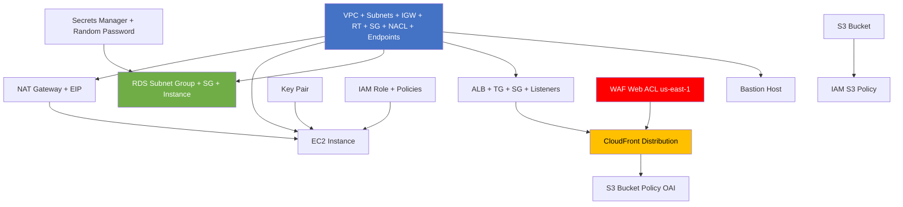
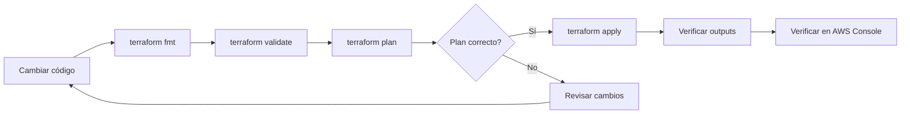

# Deployment Flow - infra-aws-zend

> **Estado**: Confirmado por código

## Visión General del Flujo de Despliegue



## Paso 1: Bootstrap (EJECUTAR SOLO UNA VEZ)

### Propósito

Crea los recursos necesarios para que Terraform almacene su state de forma remota y segura:

- **S3 Bucket**: `zend-terraform-state` (versionado, encriptado, public access blocked)
- **DynamoDB Table**: `zend-terraform-locks` (state locking, PAY_PER_REQUEST)

### Comandos

```bash
# 1. Navegar al directorio bootstrap
cd envs/bootstrap

# 2. Inicializar Terraform (backend LOCAL, sin S3 aún)
terraform init

# 3. Revisar el plan
terraform plan

# 4. Aplicar (crear S3 + DynamoDB)
terraform apply

# 5. Verificar outputs
terraform output
# Esperado:
#   state_bucket = "zend-terraform-state"
#   dynamodb_table = "zend-terraform-locks"
```

### Archivos involucrados

| Archivo | Propósito |
|---------|-----------|
| `envs/bootstrap/main.tf` | Invoca módulo `state_backend` |
| `envs/bootstrap/providers.tf` | Provider AWS, sin backend remoto (local state) |
| `envs/bootstrap/variables.tf` | Variables: bucket_name, dynamodb_table_name, aws_region |
| `envs/bootstrap/outputs.tf` | Outputs: bucket_id, dynamodb_table_id |
| `modules/state_backend/main.tf` | Recursos: S3 bucket, versioning, encryption, public access block, DynamoDB table |
| `modules/state_backend/variables.tf` | Variables del módulo |
| `modules/state_backend/outputs.tf` | Outputs del módulo |

### ⚠️ Precauciones

- **NO ejecutar `terraform destroy`** en bootstrap sin eliminar primero el entorno prod (el state de prod depende de este bucket).
- **NO cambiar los nombres** del bucket o tabla después de crearlos sin una migración de state.
- El state de bootstrap se almacena **localmente** (no en S3).
- Se recomienda hacer backup del archivo `terraform.tfstate` de bootstrap.

---

## Paso 2: Verificar Backend en providers.tf de prod

El archivo `envs/prod/providers.tf` debe tener la configuración del backend:

```hcl
terraform {
  backend "s3" {
    bucket         = "zend-terraform-state"
    key            = "prod/terraform.tfstate"
    region         = "mx-central-1"
    dynamodb_table = "zend-terraform-locks"
    encrypt        = true
  }
}
```

### Verificaciones

- [ ] El bucket `zend-terraform-state` existe en AWS
- [ ] La tabla `zend-terraform-locks` existe en DynamoDB
- [ ] La región `mx-central-1` es correcta
- [ ] `encrypt = true` está configurado

---

## Paso 3: Inicializar Terraform en prod

```bash
# 1. Navegar al directorio prod
cd envs/prod

# 2. Inicializar con backend remoto
terraform init

# Si ya tenías state local, Terraform preguntará si quieres migrar.
# Responde "yes" para migrar al backend remoto.

# 3. Si necesitas reconfigurar el backend (error o cambio)
terraform init -reconfigure
```

### Qué hace `terraform init`

1. Descarga providers: `hashicorp/aws ~> 5.0`, `hashicorp/random`
2. Descarga módulos locales desde `../../modules/*`
3. Configura backend S3 para state remoto
4. Inicializa provider alias `aws.us_east_1` para recursos en us-east-1

---

## Paso 4: Planificar Cambios

```bash
# Revisar el plan completo
terraform plan

# Guardar plan en archivo
terraform plan -out=tfplan
terraform show tfplan

# Plan con variables específicas
terraform plan -var="enable_bastion=false"
```

### Qué revisar en el plan

- [ ] Número de recursos a crear matches expectativas (~50-60 recursos)
- [ ] No hay recursos marcados para destrucción inesperada
- [ ] Los CIDRs son correctos (10.0.0.0/16, etc.)
- [ ] Las AZs son correctas (mx-central-1a, 1b, 1c)
- [ ] Los tipos de instancia son correctos (t4g.medium, db.t4g.medium)
- [ ] WAF se crea en us-east-1 (provider alias)

---

## Paso 5: Aplicar Cambios

```bash
# Aplicar con confirmación interactiva
terraform apply

# Aplicar sin confirmación (CI/CD)
terraform apply -auto-approve

# Aplicar plan guardado
terraform apply tfplan
```

### Orden implícito de creación (dependencias de Terraform)



### Tiempo estimado de creación

| Recurso | Tiempo Estimado |
|---------|----------------|
| VPC + Networking | 2-3 minutos |
| NAT Gateway | 1-2 minutos |
| EC2 Instance | 1-2 minutos |
| RDS PostgreSQL | 10-15 minutos |
| ALB | 2-3 minutos |
| CloudFront Distribution | 5-15 minutos |
| WAF Web ACL | 1-2 minutos |
| S3 Bucket | 30 segundos |
| ECR Repository | 30 segundos |
| Secrets Manager | 30 segundos |
| **Total estimado** | **20-30 minutos** |

---

## Configuración Post-Despliegue

### 1. Verificar despliegue

```bash
# Ver todos los outputs
terraform output

# Ver outputs específicos
terraform output cloudfront_distribution_domain_name
terraform output rds_endpoint
terraform output ec2_instance_id
```

### 2. Obtener credenciales RDS

```bash
# Obtener ARN del secreto
SECRET_ARN=$(aws secretsmanager list-secrets \
  --query "SecretList[?Name=='zend-app-prod-mxc1-rds-credentials'].ARN" \
  --output text --region mx-central-1)

# Obtener credenciales
aws secretsmanager get-secret-value \
  --secret-id $SECRET_ARN \
  --region mx-central-1 \
  --query SecretString --output text | jq .
```

### 3. Configurar DNS (Route 53 - MANUAL)

> ⚠️ Route 53 NO está gestionado por Terraform en este proyecto.

1. Crear Hosted Zone para `scorpionpys.mx` en Route 53
2. Crear A record (alias) apuntando al CloudFront distribution
3. Crear A record para `www.scorpionpys.mx` apuntando al mismo CloudFront

### 4. Conectarse a EC2 por SSM

```bash
INSTANCE_ID=$(terraform output -raw ec2_instance_id)
aws ssm start-session --target $INSTANCE_ID --region mx-central-1
```

### 5. Conectarse a RDS por túnel SSM

```bash
INSTANCE_ID=$(terraform output -raw ec2_instance_id)
RDS_ADDRESS=$(terraform output -raw rds_address)

aws ssm start-session \
  --target $INSTANCE_ID \
  --document-name AWS-StartPortForwardingSessionToRemoteHost \
  --parameters '{"host":["'$RDS_ADDRESS'"],"portNumber":["5432"], "localPortNumber":["5433"]}' \
  --region mx-central-1
```

---

## Lo que NO debe hacerse

| Acción | Razón |
|--------|-------|
| `terraform destroy` en bootstrap | Destruye el state backend usado por prod |
| Cambiar `bucket_name` o `dynamodb_table_name` en bootstrap | Rompe la referencia al state de prod |
| Cambiar CIDR de VPC o subnets | Fuerza recreación de TODA la infraestructura |
| Cambiar AZ de una subnet | Fuerza recreación de recursos en esa subnet |
| `terraform state rm` sin reflexión | Puede dejar recursos huérfanos en AWS |
| Modificar manualmente recursos en AWS Console | Crea drift que Terraform intentará revertir |
| Cambiar `engine_version` mayor de RDS | Upgrade mayor causa downtime significativo |
| Eliminar state file de S3 manualmente | Pérdida completa del estado de infraestructura |
| Ejecutar `terraform apply` con `-target` sin necesidad | Puede crear dependencias rotas |
| Cambiar `skip_final_snapshot` a `true` en prod | Perder snapshot final al destruir RDS |

---

## Flujo de Actualización



### Pasos para cualquier cambio

1. **Formatear**: `terraform fmt -recursive`
2. **Validar**: `terraform validate`
3. **Planificar**: `terraform plan` - revisar cuidadosamente
4. **Aplicar**: `terraform apply` - solo si el plan es correcto
5. **Verificar**: `terraform output` + AWS Console

### Validaciones pre-apply obligatorias

```bash
# 1. Formato
terraform fmt -recursive

# 2. Validación de sintaxis
terraform validate

# 3. Plan (siempre antes de apply)
terraform plan

# 4. Revisar que NO hay recursos marcados para destrucción
terraform plan | grep -i "destroy"
```