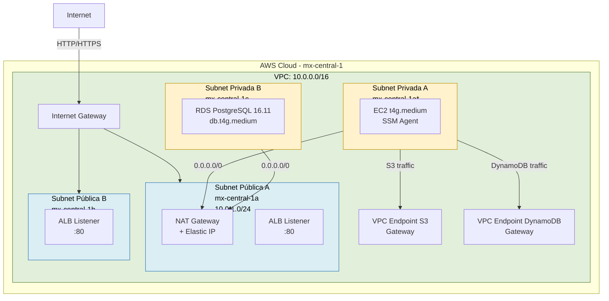
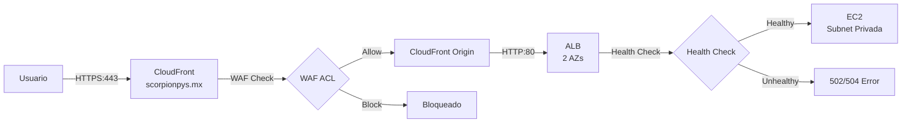
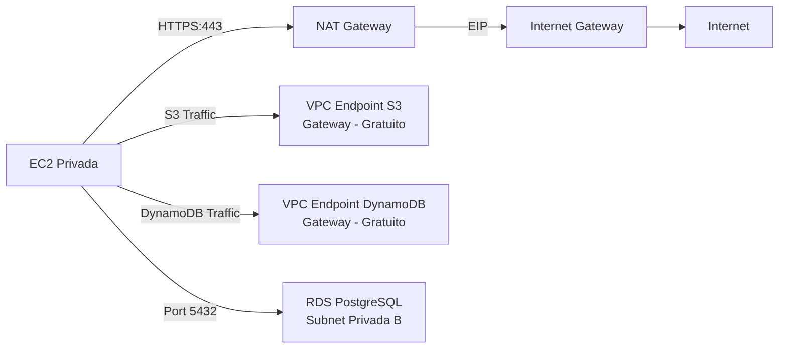
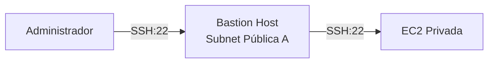

# Networking - infra-aws-zend

> **Estado**: Confirmado por código | **VPC CIDR**: 10.0.0.0/16 | **Región**: mx-central-1

## Diagrama de Topología de Red

> *Nota: La subnet privada A (10.0.2.0/24) está en mx-central-1a según el tfvars, aunque el default del módulo es mx-central-1b.*

## VPC

| Atributo | Valor | Fuente |
|----------|-------|--------|
| CIDR | 10.0.0.0/16 | `var.vpc_cidr` (default) |
| DNS Support | Habilitado (default AWS) | - |
| DNS Hostnames | Habilitado (default AWS) | - |
| Name Tag | `zend-app-prod-mxc1-vpc` | Confirmado por código |
| Region | mx-central-1 | Confirmado por código |

## Subnets

| Subnet | CIDR | AZ | Tier | map_public_ip | Propósito |
|--------|------|-----|------|---------------|-----------|
| Pública A | 10.0.1.0/24 | mx-central-1a | public | ✅ true | NAT GW, ALB, Bastion |
| Pública B | 10.0.3.0/24 | mx-central-1b | public | ✅ true | ALB (2da AZ) |
| Privada A | 10.0.2.0/24 | mx-central-1a* | private | ❌ false | EC2, RDS subnet |
| Privada B | 10.0.4.0/24 | mx-central-1c | private | ❌ false | RDS subnet |

> *AZ de subnet privada A: default es `mx-central-1b` pero `terraform.tfvars` override a `mx-central-1a`.*

### Capacidad de IPs

| Subnet | CIDR | IPs totales | IPs utilizables | Uso estimado |
|--------|------|-------------|-----------------|-------------|
| Pública A | 10.0.1.0/24 | 256 | 251 | ~5 (NAT, ALB, Bastion) |
| Pública B | 10.0.3.0/24 | 256 | 251 | ~3 (ALB) |
| Privada A | 10.0.2.0/24 | 256 | 251 | ~3 (EC2) |
| Privada B | 10.0.4.0/24 | 256 | 251 | ~2 (RDS) |

## Route Tables

### Route Table Pública

| Destino | Target | Propósito |
|---------|--------|-----------|
| 10.0.0.0/16 | local | Tráfico VPC interno |
| 0.0.0.0/0 | Internet Gateway | Acceso a Internet |

**Subnets asociadas**: Pública A, Pública B

### Route Table Privada

| Destino | Target | Propósito | Condicional |
|---------|--------|-----------|-------------|
| 10.0.0.0/16 | local | Tráfico VPC interno | Siempre |
| 0.0.0.0/0 | NAT Gateway | Salida a Internet | Si `enable_nat_gateway = true` |
| S3 (pl prefix) | VPC Endpoint S3 | Tráfico S3 sin NAT | Si `enable_vpc_endpoints = true` |
| DynamoDB (pl prefix) | VPC Endpoint DynamoDB | Tráfico DynamoDB sin NAT | Si `enable_vpc_endpoints = true` |

**Subnets asociadas**: Privada A, Privada B

## Internet Gateway

| Atributo | Valor |
|----------|-------|
| Name Tag | `zend-app-prod-mxc1-igw` |
| VPC | VPC principal |
| Propósito | Conectividad Internet para subnets públicas y NAT |

## NAT Gateway

| Atributo | Valor | Condicional |
|----------|-------|-------------|
| Subnet | Pública A (10.0.1.0/24) | Siempre en esa subnet |
| Elastic IP | Asociado | |
| Name Tag | `zend-app-prod-mxc1-nat` | |
| Habilitado | `enable_nat_gateway = true` (default en prod) | |

**Costo estimado**: ~$32/mes base + $0.045/GB de transferencia

## VPC Endpoints (Gateway Type)

| Servicio | Tipo | Route Tables Asociadas | Costo |
|----------|------|----------------------|-------|
| S3 | Gateway | Pública + Privada | Gratuito |
| DynamoDB | Gateway | Pública + Privada | Gratuito |

> Los VPC Endpoints tipo Gateway son gratuitos y no requieren Network Interface. Solo redirigen tráfico a través de las route tables.

## Security Groups

### SG Público (`zend-app-prod-mxc1-sg-public`)

| Dirección | Protocolo | Puerto | Origen | Descripción |
|-----------|-----------|--------|--------|-------------|
| Ingress | TCP | 80 | `allowed_public_ingress_cidrs` (default: 0.0.0.0/0) | HTTP |
| Ingress | TCP | 443 | `allowed_public_ingress_cidrs` (default: 0.0.0.0/0) | HTTPS |
| Egress | All | All | 0.0.0.0/0 | Todo el tráfico saliente |

### SG Privado (`zend-app-prod-mxc1-sg-private`)

| Dirección | Protocolo | Puerto | Origen | Descripción |
|-----------|-----------|--------|--------|-------------|
| Ingress | All | All | VPC CIDR (10.0.0.0/16) | Todo tráfico interno VPC |
| Egress | All | All | 0.0.0.0/0 | Todo el tráfico saliente |

> ⚠️ **Hallazgo de seguridad**: El SG privado permite TODO el tráfico intra-VPC, incluyendo puertos que no son necesarios.

### SG ALB (`zend-app-prod-mxc1-sg-alb`)

| Dirección | Protocolo | Puerto | Origen | Descripción |
|-----------|-----------|--------|--------|-------------|
| Ingress | TCP | 80 | 0.0.0.0/0 | HTTP desde Internet |
| Ingress | TCP | 443 | 0.0.0.0/0 | HTTPS desde Internet |
| Egress | All | All | 0.0.0.0/0 | Todo el tráfico saliente |

### SG Reglas Adicionales (en prod/main.tf)

| Dirección | Protocolo | Puerto | Origen | Destino | Descripción |
|-----------|-----------|--------|--------|---------|-------------|
| Ingress | TCP | 80 | SG ALB | SG Private | ALB → EC2 HTTP |
| Ingress | TCP | 443 | SG ALB | SG Private | ALB → EC2 HTTPS |

### SG Bastion (`zend-app-prod-mxc1-sg-bastion`)

| Dirección | Protocolo | Puerto | Origen | Descripción |
|-----------|-----------|--------|--------|-------------|
| Ingress | TCP | 22 | `allowed_ssh_cidrs` (default: 0.0.0.0/0) | SSH |
| Ingress | All | All | VPC CIDR | Tráfico interno VPC |
| Egress | All | All | 0.0.0.0/0 | Todo el tráfico saliente |
| Egress | TCP | 0-65535 | VPC CIDR | Tráfico saliente a VPC |

### SG RDS (`zend-app-prod-mxc1-sg-rds`)

| Dirección | Protocolo | Puerto | Origen | Descripción |
|-----------|-----------|--------|--------|-------------|
| Ingress | TCP | 5432 | SGs permitidos (EC2 privado) | PostgreSQL desde EC2 |
| Ingress | TCP | 5432 | VPC CIDR (10.0.0.0/16) | PostgreSQL desde VPC |
| Egress | All | All | 0.0.0.0/0 | Todo el tráfico saliente |

## Network ACLs

### NACL Público

| Regla # | Dirección | Protocolo | Puerto | Origen | Acción | Notas |
|---------|-----------|-----------|--------|--------|--------|-------|
| 100 | Ingress | TCP | 80 | 0.0.0.0/0 | Allow | HTTP |
| 110 | Ingress | TCP | 443 | 0.0.0.0/0 | Allow | HTTPS |
| 115 | Ingress | TCP | 22 | 0.0.0.0/0 | Allow | ⚠️ SSH abierto |
| 120 | Ingress | All | All | VPC CIDR | Allow | Tráfico VPC |
| 125 | Ingress | TCP | 0-65535 | 0.0.0.0/0 | Allow | Puertos efímeros |
| 127 | Ingress | UDP | 0-65535 | 0.0.0.0/0 | Allow | Puertos efímeros UDP |
| 130 | Ingress | ICMP | All | 0.0.0.0/0 | Allow | Ping |
| 100 | Egress | All | All | 0.0.0.0/0 | Allow | Todo saliente |
| 110 | Egress | All | All | VPC CIDR | Allow | Tráfico VPC saliente |

> ⚠️ **Hallazgo**: El NACL público es extremadamente permisivo. Permite SSH desde cualquier IP, ICMP, y todos los puertos efímeros desde 0.0.0.0/0.

### NACL Privado

| Regla # | Dirección | Protocolo | Puerto | Origen | Acción | Notas |
|---------|-----------|-----------|--------|--------|--------|-------|
| 100 | Ingress | All | All | VPC CIDR | Allow | Tráfico VPC |
| 125 | Ingress | TCP | 0-65535 | 0.0.0.0/0 | Allow | Puertos efímeros retorno NAT |
| 127 | Ingress | UDP | 0-65535 | 0.0.0.0/0 | Allow | Puertos efímeros UDP |
| 130 | Ingress | ICMP | All | 0.0.0.0/0 | Allow | Ping |
| 100 | Egress | All | All | VPC CIDR | Allow | Tráfico VPC |
| 110 | Egress | All | All | 0.0.0.0/0 | Allow | Todo saliente |

> ⚠️ **Hallazgo**: El NACL privado permite tráfico ICMP y puertos efímeros desde 0.0.0.0/0, lo cual es más de lo necesario.

## Flujo de Tráfico

### Tráfico Web Entrante

### Tráfico Saliente desde EC2

### Tráfico SSH/Bastion (si habilitado)

> SSM Session Manager es el método recomendado en lugar de SSH.

## IP Addresses y Rangos

| Recurso | IP | Tipo |
|---------|-----|------|
| NAT Gateway EIP | Asignado por AWS | Pública |
| EC2 (si en subnet pública) | Asignado por AWS | Pública |
| EC2 (en subnet privada) | 10.0.2.x | Privada |
| RDS | 10.0.4.x (o .2.x) | Privada |
| ALB | DNS name, IPs dinámicas | Pública |

## DNS y Certificados

| Recurso | Valor | Gestión |
|---------|-------|---------|
| CloudFront Domain | `dXXXXXXXX.cloudfront.net` | Terraform |
| Custom Domain | `scorpionpys.mx`, `www.scorpionpys.mx` | CloudFront aliases |
| ACM Certificate | `arn:aws:acm:us-east-1:514005485945:certificate/...` | **Externo** (hardcodeado) |
| Route 53 | No gestionado por Terraform | **Pendiente** |
| ALB DNS | Auto-generado | Terraform |

## Recomendaciones de Red

1. **Restringir NACLs**: Las reglas actuales son demasiado amplias. Recomendamos restringir puertos efímeros a rangos específicos.
2. **SG Privado**: Restringir a puertos específicos en lugar de permitir todo el tráfico VPC.
3. **NACL Público**: Eliminar regla 115 (SSH desde 0.0.0.0/0) del NACL público.
4. **Agregar VPC Endpoint para SSM**: Los endpoints de tipo Interface para `ssm`, `ssmmessages`, y `ec2messages` reducirían la dependencia del NAT Gateway.
5. **Agregar VPC Endpoint para ECR**: Reduciría el costo de transferencia de imágenes Docker.