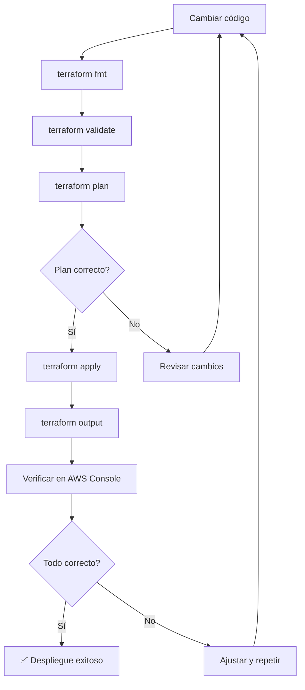

# Terraform Commands - infra-aws-zend

> **Región**: mx-central-1 | **Reglas**: Nunca ejecutar `apply`, `destroy`, `import`, `state rm/mv` sin autorización

## Comandos Seguros (Read-Only)

### Inicialización

```bash
# Inicializar Terraform (seguro, no modifica infraestructura)
terraform init

# Inicializar con reconfiguración de backend
terraform init -reconfigure

# Inicializar con upgrade de providers
terraform init -upgrade

# Validar que el backend está accesible
terraform init -backend=false
```

### Validación

```bash
# Formatear código (seguro, solo modifica archivos locales)
terraform fmt -recursive

# Validar sintaxis (seguro, no contacta AWS)
terraform validate

# Validar con JSON output
terraform validate -json
```

### Plan (Read-Only)

```bash
# Plan básico
terraform plan

# Plan detallado
terraform plan -detailed-exitcode

# Plan con variables específicas
terraform plan -var="enable_bastion=true"

# Plan con tfvars específico
terraform plan -var-file="terraform.tfvars"

# Plan y guardar a archivo
terraform plan -out=tfplan

# Mostrar plan guardado
terraform show tfplan

# Plan mostrando solo cambios
terraform plan -compact-warnings

# Verificar si hay cambios sin aplicar
terraform plan -detailed-exitcode
# Exit codes: 0 = sin cambios, 1 = error, 2 = hay cambios
```

### Outputs (Read-Only)

```bash
# Ver todos los outputs
terraform output

# Ver output específico
terraform output vpc_id
terraform output cloudfront_distribution_domain_name
terraform output rds_endpoint
terraform output ec2_instance_id

# Output en formato JSON
terraform output -json

# Output raw (para scripts)
terraform output -raw ec2_instance_id
```

### State (Read-Only)

```bash
# Ver state completo
terraform show

# Ver resource específico en state
terraform state show aws_vpc.this

# Listar todos los recursos en state
terraform state list

# Ver módulos en state
terraform state list | grep module
```

---

## Comandos de Bootstrap

```bash
# Navegar al directorio bootstrap
cd envs/bootstrap

# Formatear
terraform fmt -recursive

# Inicializar (backend LOCAL)
terraform init

# Validar
terraform validate

# Plan
terraform plan

# Aplicar (crear S3 + DynamoDB)
terraform apply

# Ver outputs
terraform output

# ⚠️ NO ejecutar terraform destroy sin autorización
```

---

## Comandos de Producción

```bash
# Navegar al directorio prod
cd envs/prod

# Formatear
terraform fmt -recursive

# Inicializar (con backend S3)
terraform init

# Validar
terraform validate

# Plan
terraform plan

# Verificar que no hay destrucciones
terraform plan 2>&1 | grep -i "destroy"

# Aplicar (requiere autorización)
terraform apply

# Ver outputs
terraform output

# Ver IDs de recursos
terraform output -json | jq '.vpc_id.value'
```

---

## Comandos de Troubleshooting

### Debug de Providers

```bash
# Ver providers configurados
terraform providers

# Ver schema de un provider
terraform providers schema -show-provider aws
```

### Debug de Módulos

```bash
# Ver módulos y sus fuentes
terraform modules

# Inicializar módulo específico
terraform init -get-modules
```

### Debug de State

```bash
# Ver estado remotamente
terraform state pull

# Ver versión del estado
terraform state pull | jq '.version'

# Ver serial del estado
terraform state pull | jq '.serial'

# Ver outputs almacenados en state
terraform state pull | jq '.outputs'
```

### Debug de Backend

```bash
# Verificar acceso al bucket S3
aws s3 ls s3://zend-terraform-state/ --region mx-central-1

# Ver versiones del state
aws s3api list-object-versions \
  --bucket zend-terraform-state \
  --prefix prod/terraform.tfstate \
  --region mx-central-1

# Descargar state actual
aws s3 cp s3://zend-terraform-state/prod/terraform.tfstate . \
  --region mx-central-1

# Ver tabla DynamoDB de locks
aws dynamodb scan \
  --table-name zend-terraform-locks \
  --region mx-central-1
```

### Resolver Problema de Lock

```bash
# ⚠️ SOLO si estás seguro de que no hay otro proceso ejecutándose

# Ver el lock en DynamoDB
aws dynamodb scan \
  --table-name zend-terraform-locks \
  --region mx-central-1

# Forzar unlock (USAR CON EXTREMO CUIDADO)
terraform force-unlock <LOCK_ID>

# El LOCK_ID aparece en el mensaje de error de Terraform
```

---

## Comandos de Validación (Pre-Apply)

### Checklist antes de Apply

```bash
# 1. Formatear código
terraform fmt -recursive

# 2. Validar sintaxis
terraform validate

# 3. Generar plan
terraform plan -out=tfplan

# 4. Verificar que no hay destrucciones
terraform show tfplan | grep -i destroy

# 5. Verificar cambios específicos
terraform show tfplan | grep -i "will be"

# 6. Si todo es correcto, aplicar
terraform apply tfplan
```

### Validar módulo específico

```bash
# Validar solo el módulo de red
terraform plan -target=module.network

# Validar solo RDS
terraform plan -target=module.rds

# Validar solo CloudFront
terraform plan -target=module.cloudfront
```

---

## Comandos de Outputs por Servicio

### Networking

```bash
terraform output vpc_id
terraform output public_subnet_id
terraform output private_subnet_id
terraform output internet_gateway_id
terraform output nat_gateway_id
terraform output nat_gateway_public_ip
terraform output s3_vpc_endpoint_id
terraform output dynamodb_vpc_endpoint_id
```

### Compute

```bash
terraform output ec2_instance_id
terraform output ec2_instance_public_ip
terraform output ec2_instance_private_ip
terraform output ec2_ebs_volume_id
```

### RDS

```bash
terraform output rds_instance_id
terraform output rds_endpoint
terraform output rds_address
terraform output rds_port
terraform output rds_database_name
terraform output rds_security_group_id
```

### S3

```bash
terraform output s3_bucket_id
terraform output s3_bucket_arn
terraform output s3_bucket_domain_name
terraform output s3_bucket_regional_domain_name
```

### ALB & CloudFront

```bash
terraform output alb_dns_name
terraform output alb_arn
terraform output alb_target_group_arn
terraform output alb_security_group_id
terraform output cloudfront_distribution_id
terraform output cloudfront_distribution_domain_name
terraform output cloudfront_distribution_arn
```

### WAF & ECR

```bash
terraform output waf_web_acl_id
terraform output waf_web_acl_arn
terraform output ecr_repository_url
terraform output ecr_repository_name
```

---

## Comandos Peligrosos (NO Ejecutar sin Autorización)

| Comando | Riesgo | Alternativa Segura |
|---------|--------|--------------------|
| `terraform destroy` | Destruye TODA la infraestructura | `terraform plan -destroy` para ver qué se destruiría |
| `terraform apply -auto-approve` | Aplica sin revisión | `terraform apply` (con revisión manual) |
| `terraform state rm` | Elimina recurso del state (no de AWS) | `terraform state list` para revisar primero |
| `terraform state mv` | Mueve recurso en state (puede romper dependencias) | Solo con plan explícito |
| `terraform import` | Importa recurso existente a Terraform | Solo con plan explícito |
| `terraform taint` | Marca recurso para recreación | `terraform apply -target=resource` |
| `terraform force-unlock` | Fuerza unlock del state | Verificar que no hay otro proceso corriendo |

---

## Flujo de Trabajo Recomendado

